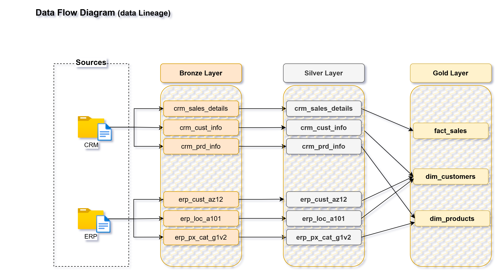

# End-to-End Data Warehouse Project Using SQL Server

Welcome to the **Data Warehouse and Analytics Project** repository! This project demonstrates a comprehensive data warehousing and analytics solution, from building a data warehouse to generating actionable insights. It highlights industry best practices in data engineering and analytics.

---
## 🏗️ Data Architecture & Flow

The data architecture for this project follows Medallion Architecture. The data flows through **Bronze**, **Silver**, and **Gold** layers:


1. **Bronze Layer**: Stores raw data as-is from the source systems. Data is ingested from CSV Files into SQL Server Database.
2. **Silver Layer**: This layer includes data cleansing, standardization, and normalization processes to prepare data for analysis.
3. **Gold Layer**: Houses business-ready data modeled into a star schema required for reporting and analytics.

---
## 📖 Project Overview 

This project involves:

1. **Data Architecture:** Designing a Modern Data Warehouse using Medallion Architecture **Bronze, Silver,** and **Gold** layers.
2. **ETL Pipelines:** Extracting, transforming, and loading data from source systems into the warehouse.
3. **Data Modeling:** Developing fact and dimension tables optimized for analytical queries.
4. **Analytics & Reporting:** Creating SQL-based reports and dashboards for actionable insights.

🎯 This repository showcases expertise in:
- SQL Development
- Data Architecture
- Data Engineering  
- ETL Pipeline Developer  
- Data Modeling  
- Data Analytics

---
## 🚀 Project Requirements

### Building the Data Warehouse (Data Engineering)

#### Objective
Develop a modern data warehouse using SQL Server to consolidate sales data, enabling analytical reporting and informed decision-making. 

#### Specifications
- **Data Sources**: Import data from two sources systems (ERP and CRM) provided as CSV files.
- **Data Quality**: Cleanse and resolve data quality issues prior to analysis.
- **Integration**: Combine both sources into a single, user-friendly data model designed for analytical queries.
- **Scope**: Focus on the latest dataset only; historization of data is not required.
- **Documentation**: Provide clear documentation of data model to support both business stakeholders and analytics team.

---

### BI: Analytics & Reporting (Data Analysis)

### Objective
Develop SQL-based analytics to deliver detailed insights into: 
- **Customer Behaviour**
- **Product Performance**
- **Sales Trends**

These insights empowers stakeholders with key business metrics, enabling strategic decision-making.

## 📂 Repository Structure
```
data-warehouse-project/
│
├── datasets/                           # Raw datasets used for the project (ERP and CRM data)
│
├── docs/                               # Project documentation and architecture details
│   ├── data_catalog.md                 # Catalog of datasets, including field descriptions and metadata
│   ├── data_flow.drawio                # Draw.io file for the data flow diagram
|   ├── data_integration.drawio         # Draw.io file for the data integration diagram
│   ├── data_models.drawio              # Draw.io file for data models (star schema)
│
├── scripts/                            # SQL scripts for ETL and transformations
│   ├── bronze/                         # Scripts for extracting and loading raw data
│   ├── silver/                         # Scripts for cleaning and transforming data
│   ├── gold/                           # Scripts for creating analytical models
│
├── tests/                              # Test scripts and quality files
│
├── LICENSE                             # License information for the repositor
└──  README.md                          # Project overview and instructions 
```
---

## 🛡️ License
This project is licensed under the [MIT License].(License). And is free to use, modify and share this project with proper attribution.

---
## 💻 Tech Stack Used fro this repository
[](https://www.microsoft.com/en-us/sql-server)
[]()
[]()
[](https://app.diagrams.net/)

---
## 🌱 About Me✨

Hi there! I'm **Shraddha Bisht**. 
Thanks for checking out this project! I'm passionate about Data Analytics, SQL, Power BI, and Data Engineering, and I regularly build projects to strengthen my skills and explore real-world data challenges.

### ☕ Stay Connected
Let's stay in touch!
If you found this project useful, feel free to connect with me on LinkedIn.
[](https://linkedin.com/in/shraddha-bisht)
